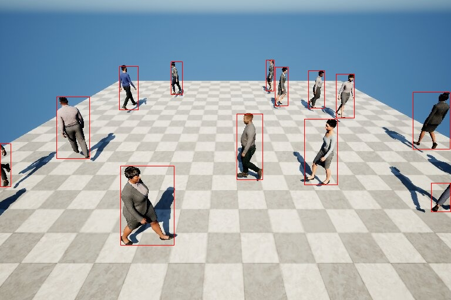
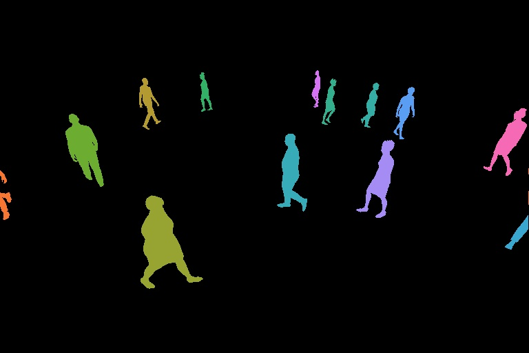

# CV4UE - Computer Vision for Unreal Engine

 ## Discription

 This is a UE 5.1 plugin for synthetic data generation.

## Demo

[Video example](https://youtube.com/watch?v=hYsrO-sGn-o&si=EnSIkaIECMiOmarE)

 ## Instalation

* Clone the repo.

* Open `Engine/Build/BatchFiles` in Unreal Engine location.

* Run RunUAT script to build the plugin:
    * **Windows**: `RunUAT.bat BuildPlugin -plugin="[uplugin file path]" -package="[temporary location]"`
    * **Linux/OSX**: `RunUAT.sh BuildPlugin -plugin="[uplugin file path]" -package="[temporary location]"`

* Copy the plugin from temporary location to the Engine or your project location.

## How to use

* Enable the plugin in `Edit > Plugins`.
* Select  `Enabled with Stencil` in `Edit > Project Settings > Postprocessing > Custom Depth-Stencil Pass`.
* Enable `Render CustomDepth Pass` and set `CustomDepth Stencil Value` (from 0 to 255) for objects in scene you would like to registrate. Different object should have differents `CustomDepth Stencil Value`s.
* Put `BP_MultiCapturing` from `Plugins/cv4ue Content/Blueprints`. This Bluprint class contais three instances of `BP_Capturing` that capture Scene, Depth and Masks.
* Now you can play directly the level in editor viewport.
* The results are located in `ProjectFolder/Saved/{img, depth, mask}`.

The scene and depth capturings produce `.jpeg` images, while masks are converted into **COCO-like** `.json` annotation files. In annonation file you find:
* images - list of images data, always contains just one element.
    * id - image ID,
    * width - image width
    * height - image heigh
    * file_name - image file name
    * license - always 0, not used, license ID 
    * fov - field of view of the camera used for capturing
    * offsets - camera offset
    * camera_translation - camera translation
    * camera_rotation - camera rotation
* annotations - lsit of annotations
    * id - instance ID  
    * image_id - image ID
    * category_id - always 1 (person), the id of the current stuff category
    * area - area of the bounding box
    * iscrowd - always 1, the instance represents a single object (`0`) or a collection of objects (`1`)
    * segemntation - instance segmentation in RLE format
    * bbox - bounding box in flatted format `(upper left corner, lower right corner)`
  
**Remark**: Firstly, the plugin was created for Crowd Simulation. This is the reason why several values are hard coded. Furthermore, the dataset with the sctructure of COCO dataset can't be directly created in Unreal Engine without external data postprocessing.

## Usefull information
* You can find jupyter notebook with usefull Python functions (RLE encoding/decoding, data loading and visualization) in `Demo/demo.ipynb`
* The tutorial about MassEntity system, the plugin and Unreal Engine is also vailable in `TUTORIAL.md`
