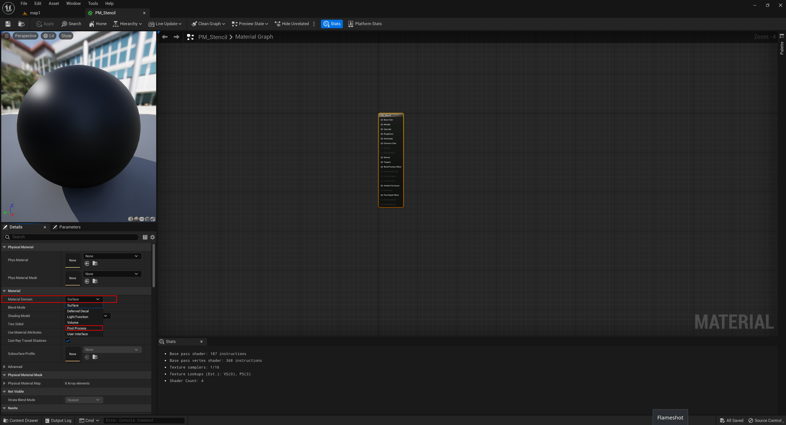

# **Tutorial**

## **Installation**
First of all, you need to install Unreal Engine 5. Although it can be installed on all platforms, it seems to me, Windows is supported better than macOS and macOs is supported better than Linux.
There are two ways
1. Install Epic Games Launcher first and then Unreal Engine 5. This way works for Windows and macOS.
2. Compile from the source. It supports all platforms. However, this way is tricky not only for installation but also for future use.

## **Scene creation**
Once Unreal Engine 5 was installed, let’s create a new scene. 
Create a new Blank project:

Add a new basic level:

### **MassEntity**
Now we can start to play around with MassEntity. MassEntity is a plugin in Unreal Engine 5 for data-oriented calculation. The overview could be found [here](https://docs.unrealengine.com/5.0/en-US/overview-of-mass-entity-in-unreal-engine/) or [here](https://www.youtube.com/watch?v=f9q8A-9DvPo). The first application was the demo The Matrix Awakens. The plugin is quite new and still in development. And unfortunately, the documentation is missing and the existing tutorials which could be found are a bit outdated.
I used [this tutotrial](https://www.youtube.com/watch?v=2LvUB3_PAhI). There were no problems except a few easy to solve. So you can follow it with some small changes to solve possible problems that I’ll describe below
When you open `BP_CrowdCharacter`, you should see four warning starting by `Get SkeletalMesh: ` :

As written in warnings, replace all problem nodes by GetSkeletalMeshAsset:

At 6:00, add two fragments (Transform Fragments and Agent Radius Fragments) into Assorted Fragments. Simulation doesn’t work without those two fragments.

While starting the simulation you can see this error: 

I didn’t figure out how to fix it. I only found [this discussion on the official UE forum](https://forums.unrealengine.com/t/solved-ue5-mass-ai-some-traits-are-requiring-the-presence-of-fragments-which-are-missing/691512). Anyway, the simulation works.
At 8:02, don’t close `DA_CrowdAgent`, but expand the StateTree fragment and create a StateTree following this way. I don’t know (likely a bug) why, but the way it's presented in the video doesn’t work : it is impossible to select the StateTree in the fragment setting.

Now we have a pedestrian simulation. Time to capture and create annotations.

## **Masking** 
Unreal Engine 5 has several methods to create masks. You can find videos about them, for example [here](https://www.youtube.com/watch?v=PiQ_JLJKi0M) and [here](https://www.youtube.com/watch?v=JH07z9Ap1hk). I recommend you to watch the first video. Next we’ll see how to create instance segmentation masks via a stencil buffer.
The stencil buffer is one of multiple buffers used for rendering. The objective of this buffer is to limit the area of rendering. The possible way of its application can be found below: https://www.youtube.com/watch?v=EzM8LGzMjmc
The first thing we need is to enable Custom Depth-Stencil Pass.
Edit->Project Setings…. 

Write “depth” and enable Custom Depth-Stencil Pass with the value Enabled with stencil 

If you want to change the stencil value of an object, select the object, enable Render CustomDepth Pass in its settings and set a value you wish to Custom DepthStencil Value. 
Example with a plane: 

It is possible to visualize the scene with the stencil value. Click Lit->Buffer Visualization->Custom Stencil 

Let's return to `BP_CrowdCharacter`. Actors created by MassEntity system don’t exist at the begging of the simulation/game. So, iterating through all objects in the scene and changing their stencil value at the beginning is not a good idea. This is the reason why [UnrealGT](https://github.com/unrealgt/unrealgt) doesn’t work with the MassEntity system. It seems there are two ways to handle it:
1. Use MassSpawner from the MassEntity system in order to set the stencil value (honestly I tried this approach several times, didn't succeed)
2. Set the stencil value in ”the constructor” of `BP_CrowdCharacter`
As you might have guessed, I’am going to show the second approach. 
Open BP_CrowdCharacter. Add a new function, call it SetStencilValue and drop into SetupComponents. Open this function and create a Blueprint graph as shown below. ue_00024.
The logic is pretty simple. We get an array of all objects of class `BP_CrowdCharacter` that have been created until the present. The length of this array plus one is used as the stencil value of Mesh or Groom Components of the new object of class `BP_CrowdCharacter`. In our case, Skeletal Mesh Components are Bottom, Shoes, Top, Accessory, Body, Face, Hair, Beard, Mustache.

Return to the ConstructionScript. 

And add the SetStencilValue function. 

Now we need to create a post processing material. It could be used for masking, depth map, normal map or whatever.
Right click and chose “Material”:

Open it and change “Material domain” from “Surface” to “Post Process”: 

Right click and add “Scene Texture”: 

Change “Scene Texture Id” from “SceneColor” to “CustomStencil”: 

Right click and add the Divide node. Connect all nodes:

You can find the example of a post processing material for the depth capture: 

## **Writing on disk**
There is a very good tutorial about Image capturing for Unreal Engine 4, 5 - [link](https://github.com/TimmHess/UnrealImageCapture).
A few words about it. The main idea is to capture the screen without blocking RenderThread and GameThread. Otherwise, FPS is dropped down (until 3-5). A render request is placed on the UE rendering pipeline. Once the render request is completed and all data (i.e. screen capture, masks, depth) is ready, we save the data to disk via an asynchronous procedure in order not to block GameThread.
I recommend you to read the [full tutorial](https://github.com/TimmHess/UnrealImageCapture) mentioned above.

I've added several changes to the ‘CameraCaptureManager’ class, but the general structure stays the same.
1. CaptureComponent (USceneCaptureComponent2D) is created and attached to the RootComponent in the constructor.
2. CaptureComponent->GetCaptureComponent2D()->... is replaced just by CaptureComponent->...
3. I removed the .png format and float scene capturing for CaptureManager
4. The original code is a bit outdated (if the comments in the source code of UE 5.1 are still reliable). All preparations for writing to disk could be done just by one line: ImageWrapperModule.CompressImage(ImgData, EImageFormat::PNG, FImageView(nextRenderRequest->Image.GetData(), FrameWidth, FrameHeight));
5. Implemented a code in order to transform mask into rle-encoding
6. Added structs for CoCo-like annotations (in the folder CoCoDataStruct)
7. Added RunAsyncJsonSaveTask AsyncSaveJsonToDiskTask to save json to disk
8. All AsyncTasks moved to separated files in the folder AsyncTasks

Unreal Engine includes the class [FJsonObjectConverter](https://docs.unrealengine.com/4.27/en-US/API/Runtime/JsonUtilities/FJsonObjectConverter/) that can convert a UStruct (defined by you) to JsonObject and vice versa. Then the JsonObject can be serialized and write to disk by [FFileHelper](https://docs.unrealengine.com/4.27/en-US/API/Runtime/Core/Misc/FFileHelper/)::SaveStringToFile
